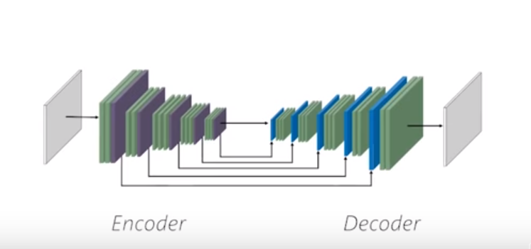

# Using pix2pix to give color to the flowers in grayscale
I have made this program using the algorithm pix2pix. This program converts images from grayscale to color.

## Why flowers?
I tried with all kind of images but it is to difficult and it would need a lot of images and several days to train my model. Then I tried it with images of a specific subject, images of flowers.

The model have been trained using images of flowers from: http://www.robots.ox.ac.uk/~vgg/data/flowers/102/index.html

## Converting images to grayscale
To train my model I needed the real images and the images in grayscale.
I used a very simple program to transform the [images to grayscale](/images%20to%20grayscale.ipynb).
With this I have 8189 color images and 8189 images in grayscale and this is my dataset.

## Motivation
To implement this pix2pix algorithm I have based on [the explanation on tensorflow](https://www.tensorflow.org/beta/tutorials/generative/pix2pix) and the [youtube video of Dot CSV](https://youtu.be/YsrMGcgfETY). I want to participate in the challenge [#RetoDotCSV2080Super](https://www.youtube.com/watch?v=BNgAaCK920E).

## The model
This is the arquitecture of the pix2pix algorithm:

To train this model used the 80% (6551) of the images as train set and 20% (1638) as test set. It took me 1 day to train the model with my own computer.
After this my model was able to put colors in the image. The images generated are not an exact copy of the original image, but they are images that look real. If you don't know the original photo and you see the photo generated by the model it looks like a photo of a real flower. 

In the first column we can se the grayscale images, in the second column we can see the real images and the third column is the column of the generated images.
